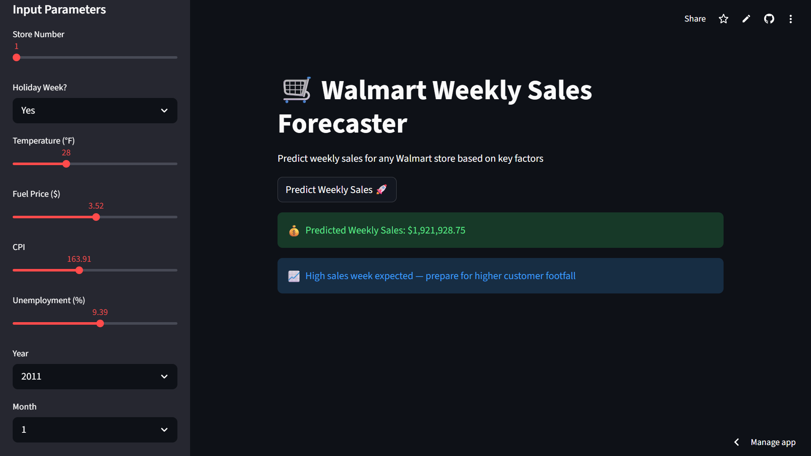

# 🛒 Walmart Weekly Sales Forecaster
A machine learning web app that predicts weekly sales for Walmart stores based on key retail factors.

## 🔗 Live Demo
[Click here to try the app](https://walmart-sales-forecaster-8rjitgxycmzbww6dg4bp56.streamlit.app/)

## 📌 Project Overview
Predicted weekly sales of 45 Walmart stores using historical retail data and machine learning. 
The predictions help identify high, average and low sales weeks to guide business operations.

## 📊 Dataset
- **Source:** [Walmart Dataset — Kaggle](https://www.kaggle.com/datasets/yasserh/walmart-dataset)
- **Problem Type:** Regression
- **Period:** Feb 2010 to Nov 2012
- **Size:** 6,435 rows, 8 columns
- **Features:** Store, Holiday Flag, Temperature, Fuel Price, CPI, Unemployment

## 🤖 Models Compared
|      Model        |R2 Score|
|-------------------|--------|
| Linear Regression |  0.15  |
| Decision Tree     |  0.93  |
| Random Forest     |  0.96  |

## 🛠️ Tech Stack
- **Language:** Python
- **ML Libraries:** Scikit-learn
- **Data Processing:** Pandas, NumPy
- **Visualization:** Matplotlib, Seaborn
- **Deployment:** Streamlit
- **Version Control:** GitHub

## 📸 App Screenshot

## 📈 Key Findings
- Random Forest achieved 96% R2 score
- Holiday weeks show significantly higher sales
- Store size and department are strongest predictors
